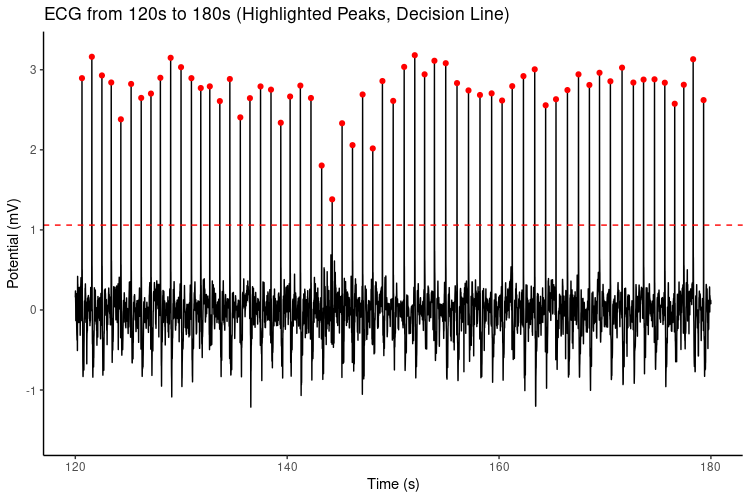

```{r setup, include=FALSE}
knitr::opts_chunk$set(echo = TRUE)
```

## Introduction

An electrocardiogram (ecg) was provided for a simple analysis as part of the interview process for a co-op position at the Magnetic Resonance Physics and Instrumentation Group (MRPIG) at Massachussetts General Hospital (MGH). The assigned tasks were to extract the time indexes of the ecg peaks and to produce a root mean square of sequential differences (rmssd) time series. This report describes the approach used to accomplish these tasks and briefly analyzes the results.

## Methods and Results

The analysis was written in R, and the library `R.matlab` was used to read the "ecgsamp.mat" file into an array. Creating an array of the indexes of the ecg peaks was accomplished in two steps. The first step involved creating a decision line above which ecg points were considered to be part of a peaking spike, and the second step found the maximum point for each spike. The decision line was placed 2.58 standard deviations above the mean ecg value, so above 99.5% of the points, which when viewed in a graph (as in figure 1) is clearly above all small spikes but below all peaks of interest. Data from the ecg above the decision line was then run through an algorithm which kept only the index of the largest ecg value for each peaking spike, the results were saved (via `R.matlab`) to "peak_indexes.mat". Figure 1 depicts the decision line and the peak points of interest for an example period from 120 seconds to 180 seconds.^[Note: It was inferred that the ecg data was in microvolts and sampled at 250 Hertz because this produced reasonable results. However, it is possible that the Hertz was over- or underestimated depending if the subject was human and if the subject was under physiological stress.]

Figure 1.
<center>

</center>

Since no time epoch width was explicitly stated for the rmssd series, a function, `rmssd_series(time.series, step, epoch_width)`, was written to compute the rmssd for any arbitrary epoch width. Some preliminary research turned up an article^[M. Loretto Munoz et al. September 28, 2015. Validity of (Ultra-)Short Recordings for Heart Rate Variability Measurements. PLOS One.] by M. Munoz et al. which describes "240s-300s" as the industry standard but indicates that ultra-short epochs are a valid alternative. The article states that the correlation between using a 10-second epoch versus a 240-second was "substantial" and agreement improved for epochs of increasing length reaching "near perfect" agreement at 120 seconds. Inspired by this article, two rmssd series were created--one with a 240-second epoch and one with a 30-second epoch, shown in figures 2 and 3 respectively.

Figure 2.
<center>

</center>

Figure 3.
<center>

</center>

As clearly visible in both figures 2 and 3, it appears there was a significant increase in heart rate variability at around 180 seconds which lasted until around 210 seconds.